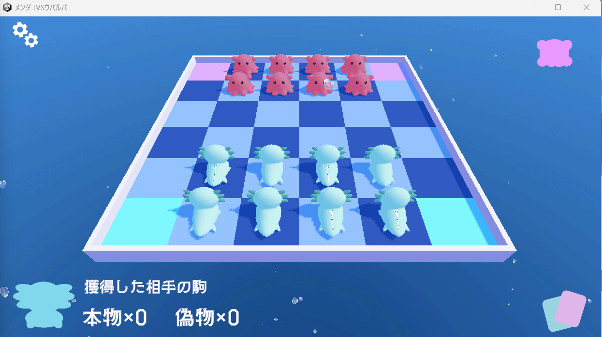

# メンダコ vs ウーパールーパー

## 概要
ボードゲーム「ガイスター」をもとにした、 
<strong>将棋×心理戦×カードゲーム</strong> 
です！ 
海のアイドル、メンダコとウーパールーパーに分かれていざ対戦！ 
自由に配置する、各4駒の可愛い「本物」と背中にチャックの付いた「偽物」を
動かし方や会話から見破れ！ 
相手の本物を全て取る or 自分の偽者を全て取らせる ことが勝利条件！ 
審美眼に長けた本物のアイドルの座は、どちらの手に...？

## 分担
@uyuuuuu :  
ゲームデザイン 
フロントエンド全般(UI, オブジェクト移動, パーティクル) 
デザイナー(カード、UI、モデリング等全般)  
@nazunanana :  
ゲームデザイン 
通信 
内部動作処理 

 画面下部に詳細を記載

## 使用言語
all by C#(Unity)

## 使用ライブラリ
Photon fusion2.0.1

## プレイ時間/プレイ人数
5~10分程度 
2人

## ルール説明
メンダコとウーパールーパーの陣営に分かれ、「本物」と背中にチャックの付いた「偽物」をホードに配置。将棋のように駒を進め、自分の本物の駒が取られるとスキル付きのカードを1枚ランダムで獲得し、1枚1回使用することが出来ます。
相手の本物の駒4つを全て獲得するか、自分の偽物の駒4つを全て相手に取らせると勝利、ゲーム終了です。

## 操作方法
- スタートボタンを押し、対戦相手と同じパスワードを入力
- キャラクターをクリック→マスをクリックで、紫の枠線内に駒8つを配置
- 将棋のように駒を進め、相手の駒を獲得する
- 自分のターン開始時、右下のカードアイコンをクリックしてカードをクリックすることでカードスキルが発動する
- 相手の偽物駒一つが判明するスキルカードは、偽物駒のあるマスが数秒白くハイライトされる

## 更新情報
2024/7/21
- たまになにもないマスでも前に進めない場合あり

## 画面スクリーンショット

## 動作例動画

<video controls src="https://drive.google.com/file/d/1AM2C2TA3CRL0S4l8SOmQv6y9sXNO4xEb/view?usp=sharing" muted="false"></video>

## 分担詳細
協力
- ゲームデザイン
- ターン遷移、駒移動に関する修正(バグが多数発生したため)

@uyuuuuu
- キャラのモデリング、アニメーション
- シェーダー作成(自作)
- UI、パーティクル、スカイボックスのテクスチャ作成と実装
- 駒配置、移動処理の基盤作成
- マスと駒のコライダー可否とハイライト処理

@nazunanana
- 通信によるマッチングシステム
- カードシステム実装
- キャラクター生成処理
- 取得駒の廃棄処理
- カメラ位置分岐